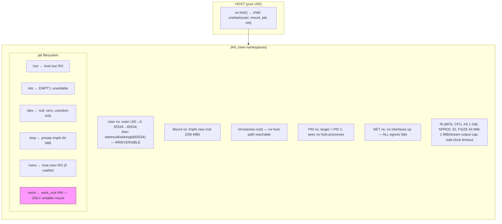

# CASI — System Architecture (Milestone 2: security hardening)

**Version:** 0.2.0 · **Date:** 2026-10-08
**Status:** Build in progress. This document is the integration contract — all builders implement against it.

Component status labels: `COMPLETED` = verified working on this VM ·
`SIMPLIFIED` = works, not production-grade · `EXPERIMENTAL` = partially
verified · `FUTURE` = not implemented · `BLOCKED` = cannot proceed yet.

## 1. Design principles

1. **Zero external services to boot.** The core loop (plan → execute → test → repair → verify → approve) runs with nothing but Python 3.11+ and pip packages. No Ollama, no Docker, no network required. (This is a deliberate break from the base repo, whose hard Ollama dependency is documented in the gap analysis.)
2. **Real execution, honest intelligence.** Sandboxing, DAG scheduling, test execution, traceback parsing, patching, approval gates, and audit logging are genuinely implemented. Language intelligence is rule-based/heuristic by default; a real model can be plugged in via the `LLMProvider` seam (Ollama and Nebius providers implemented and smoke-tested). We never claim the mock reasons.
3. **Fail closed.** Permissions deny by default; approval gates block; the sandbox is namespace-isolated with no host fallback; deployments refuse to start when insecurely configured.
4. **Everything is observable.** Every goal, task, tool call, test run, patch, approval, and cost event lands in the audit log.

## 2. Package layout

```
~/workspace/casi-ai-os/
  casi/                      # the deliverable package
    __init__.py              # __version__ = "0.2.0"
    config.py                # Settings (pydantic-settings, CASI_* env vars) + validate_deployment()
    kernel.py                # AIKernel — owns all components, goal lifecycle
    planner.py               # goal decomposition -> Plan[TaskSpec]
    scheduler.py             # DAGScheduler — validation, levels, parallel run, retries, checkpoints
    agents/
      base.py                # Agent ABC, AgentContext (+role), AgentResult, require_capability, AgentRegistry
      supervisor.py          # capability-based task assignment (+ clarify short-circuit)
      coder.py               # writes code artifacts (provider hook, deterministic fallback)
      tester.py              # runs pytest in namespace sandbox -> TestReport
      debugger.py            # traceback parsing + 4 repair strategies
      reviewer.py            # real artifact checks (exists/non-empty/compiles/tests green)
      researcher.py          # context gathering from memory + workspace files
      planner_agent.py       # structured task-list plans; blank→ValueError, vague→clarifying plan
    memory/
      store.py               # WorkingMemory + LongTermMemory (TF-IDF recall, JSONL persistence)
    execution/
      sandbox.py             # run(): namespace jail (user/mount/pid/net), chroot, rlimits, output caps
    models/
      providers.py           # LLMProvider ABC, MockProvider, OllamaProvider, NebiusProvider, ModelRouter, CostTracker
    security/
      auth.py                # API-key auth -> Role; per-endpoint capability gates
      permissions.py         # Capability enum, Role, check(); APPROVE_OWN_RUNS, MANAGE_GOALS
      approvals.py           # ApprovalGate: request/resolve/pending/wait + audit_hook
      audit.py               # AuditLog -> JSONL
    filesystem/
      workspace.py           # Workspace: files + metadata + version history + search
    integrations/
      plugins.py             # Plugin ABC, PluginRegistry, RagQueryTool (base-repo RAG client),
                             # Multimodal/Robotics stubs (NotImplementedError)
    api/
      app.py                 # FastAPI factory create_app(kernel)
      schemas.py             # request/response models
  tests/                     # pytest suite (277 collected; 273 passed, 0 failed, 2026-10-08)
  scripts/
    run_milestone_demo.py    # end-to-end acceptance demo (namespace sandbox; --auto-approve via Role.ADMIN)
    run_llm_smoke.py         # live provider smoke test (Ollama / Nebius)
  evidence/llm_smoke.log     # REAL Ollama 0.40.1 smoke-test transcript (qwen2.5:0.5b)
  requirements.txt  Dockerfile  docker-compose.yml  .env.example
  ARCHITECTURE.md  ROADMAP.md  SETUP.md  LIMITATIONS.md  SECURITY.md  PHASE3_PLAN.md
  ARCHITECTURE_GAP_ANALYSIS.md   # Phase-1 historical analysis; kept as-is
```

## 3. Component status

| Component | Status | Notes |
|---|---|---|
| Kernel / goal lifecycle | COMPLETED | plan → schedule → execute → verify → approval; auto-approve double-gated |
| Planner (rule-based) | COMPLETED | blank goals → `ValueError`; vague goals → clarifying plan |
| DAG scheduler | COMPLETED | validation, topological levels, parallel run, retries, checkpoints, cancellation, partial-failure semantics, crash-resume |
| Agents (7: supervisor, coder, tester, debugger, reviewer, researcher, planner_agent) | COMPLETED (rule-based) | deterministic heuristics; each proven end-to-end; reviewer does real checks |
| Memory | COMPLETED | cross-process JSONL persistence; TF-IDF recall (not embeddings) |
| Namespace sandbox | COMPLETED | 31 tests; no host fallback; `CASI_SANDBOX_MODE=strict` only |
| Auth (API keys → roles) | COMPLETED | 3 keys, per-endpoint gates, `validate_deployment()` fail-fast |
| Approvals | COMPLETED | `APPROVE_OWN_RUNS` ADMIN-only; bypass audited; in-memory (SIMPLIFIED) |
| Audit log | SIMPLIFIED | JSONL append; no tamper-evidence, no rotation |
| Models: MockProvider | COMPLETED | deterministic; never claims to reason |
| Models: OllamaProvider | EXPERIMENTAL | hardened (timeouts, retries, env config); REAL smoke test green on this VM |
| Models: NebiusProvider | EXPERIMENTAL | 401-mapping verified live with dummy key; real completion UNVERIFIED (no key) |
| ModelRouter / CostTracker | COMPLETED | routing by task_kind; token/cost accounting (chars/4 estimates for mock) |
| Workspace filesystem | COMPLETED | jailed paths, versioned writes, search |
| Plugin registry | COMPLETED | dispatch works |
| RagQueryTool (base-repo RAG client) | COMPLETED | optional HTTP client for base-repo `POST /query`; disabled by default via `CASI_RAG_API_URL`; http(s) scheme enforced; 5 unit tests |
| Multimodal / Robotics plugins | FUTURE | explicit `NotImplementedError` stubs (Phases 7–8) |
| FastAPI surface | COMPLETED | health, goals, run, cancel, agents, artifacts, approvals, logs |
| Web UI | FUTURE | Phase 3 (see PHASE3_PLAN.md) |

## 4. Diagrams

### 4a. Sandbox jail layout



Fail-closed contract: any failure in `unshare`, mounts, `chroot`,
uid-map setup, or jail construction raises `SandboxUnavailable` and the
command is **never** executed on the host. No Docker backend, no
`"subprocess"` fallback.

### 4b. Auth + approval flow (sequence)

```mermaid
sequenceDiagram
    participant C as Client
    participant API as FastAPI (verify_api_key)
    participant K as AIKernel
    participant Gate as ApprovalGate
    participant H as Human (API/CLI)

    C->>API: X-API-Key: <key>
    API->>API: key→role (ADMIN/OPERATOR/VIEWER); unknown→401
    API->>API: require_capability (403 if lacking)
    C->>K: POST /goals/{id}/run {auto_approve: true}
    K->>K: _require_auto_approve():<br/>flag AND role has APPROVE_OWN_RUNS?<br/>no → 403 + audit approval.bypass_denied
    K->>K: plan → schedule → agents → sandbox
    K->>Gate: request("publish", {goal_id})
    alt auto_approve (authorized)
        K->>Gate: resolve(approved) via _auto_resolve_approval
        K->>K: audit approval.auto_approved {actor_role}
    else manual
        Gate-->>H: pending approval (GET /approvals/pending)
        H->>Gate: POST /approvals/{id}/resolve {approved}
        Gate->>Gate: emit approval.requested / approval.resolved → audit log
    end
    alt rejected
        Gate-->>K: PermissionDenied → goal FAILED (never auto-publishes)
    end
```

### 4c. Goal execution pipeline

```mermaid
flowchart LR
    G["create_goal(text)"] --> P["Planner<br/>decompose_goal → Plan[TaskSpec]<br/>(rule-based; blank→ValueError)"]
    P --> V["Scheduler.validate()<br/>unknown deps / cycles → PlanError"]
    V --> L["levels(): topological<br/>levels (Kahn)"]
    L --> R["DAGScheduler.run()<br/>levels sequential;<br/>tasks per level parallel (ThreadPoolExecutor);<br/>retries w/ backoff;<br/>checkpoint per level;<br/>crash-resume"]
    R --> A["Agents (via supervisor + registry)<br/>ctx carries role → require_capability()"]
    A --> S["Namespace sandbox<br/>tester runs pytest jailed"]
    S --> D{"tests fail?"}
    D -->|"yes, ≤ max_retries"| DB["debugger:<br/>parse traceback →<br/>repair strategy → patch<br/>(4 strategies)"]
    DB --> S
    D -->|"no / retries exhausted"| RV["reviewer:<br/>exists / non-empty /<br/>compiles / tests green"]
    RV --> AP{"approval_required?"}
    AP -->|yes| GATE["ApprovalGate<br/>publish approval"]
    GATE -->|approved / auto| DONE["COMPLETED"]
    GATE -->|rejected / timeout| FAIL["FAILED"]
    AP -->|no| DONE
```



## 5. Integration contracts (normative)

(§5.1–§5.9 carry forward the Milestone-1 contracts with Milestone-2
amendments; unchanged signatures are summarized, not repeated verbatim.)

### 5.1 Planner (`casi/planner.py`) — COMPLETED

`decompose_goal(goal_text, goal_id, model_router=None) -> Plan`.
Rule-based decomposer for software goals (deterministic; keyword/pattern
driven). Blank goals → `ValueError`; vague goals → clarifying plan.
`model_router` hook reserved for LLM-assisted decomposition (FUTURE).

### 5.2 Agents (`casi/agents/base.py`) — COMPLETED (rule-based)

Contracts as Milestone 1, plus: `AgentContext.role: Role | None`;
`require_capability(ctx, capability)` is the single permission choke
point (lazy-imports `casi.security.permissions`; `role=None` = legacy
ungated). Per-agent gates: coder→`WRITE_WORKSPACE`;
tester→`EXECUTE_CODE`; debugger→`READ_WORKSPACE`+`WRITE_WORKSPACE`;
reviewer/researcher→`READ_WORKSPACE`; planner_agent→`WRITE_WORKSPACE`.

### 5.3 Scheduler (`casi/scheduler.py`) — COMPLETED

As Milestone 1, plus: partial-failure semantics (a failed task marks
dependents `skipped`, independent branches still run) and crash-resume
from checkpoint — both tested.

### 5.4 Execution sandbox (`casi/execution/sandbox.py`) — COMPLETED

The hardened-subprocess sketch from Milestone 1 is replaced by the
namespace jail (see §4a and SECURITY.md §2). `Sandbox(work_root)`,
`run(cmd, cwd, timeout_s, env) -> ExecResult` with new fields
`truncated: bool`. `CASI_SANDBOX_MODE` must be `"strict"` (only value).
No Docker backend. `backend` property removed — there is exactly one
backend now.

### 5.5 Memory (`casi/memory/store.py`) — COMPLETED

As Milestone 1: `WorkingMemory`, `LongTermMemory` (TF-IDF recall,
deterministic), `MemorySystem` with cross-process JSONL persistence
(tested). Recall is TF-IDF, not embeddings — SIMPLIFIED by design.

### 5.6 Models (`casi/models/providers.py`) — COMPLETED / EXPERIMENTAL

Error taxonomy: `ProviderConnectionError`, `ProviderTimeoutError`,
`ProviderResponseError`, `ProviderAuthError`, `ProviderConfigurationError`.
`OllamaProvider` hardened: httpx, 5s connect / 120s read timeouts, 2
retries with backoff, `OLLAMA_HOST`/`OLLAMA_MODEL` env, `list_models`.
**New** `NebiusProvider` (OpenAI-compatible,
`https://api.studio.nebius.com/v1`, `NEBIUS_API_KEY` read from env **at
call time**, `NEBIUS_MODEL` default
`meta-llama/Meta-Llama-3.1-8B-Instruct`). `MockProvider` kept;
`CASI_DEFAULT_PROVIDER` = `mock | ollama | nebius`.

Verification: REAL Ollama 0.40.1 on this VM; `qwen2.5:0.5b` imported via
`ollama create` from a HF GGUF (`ollama pull` blocked by sandbox DNS);
smoke test green — `evidence/llm_smoke.log` shows `list_models` →
`['qwen2.5:0.5b']`, real completions `SMOKE-OK` via provider *and* router,
token/cost accounting. Nebius: no API key → real completion UNVERIFIED;
401-mapping verified live with a dummy key.

### 5.7 Security (`casi/security/`) — COMPLETED / SIMPLIFIED

- `permissions.py`: `Capability` gains `APPROVE_OWN_RUNS` (ADMIN only)
  and `MANAGE_GOALS` (ADMIN+OPERATOR); `check()` fails closed.
- `auth.py`: `verify_api_key` → `Role`; 401 on unknown key when any key
  configured; VIEWER-with-warning when none configured.
- `approvals.py`: `ApprovalGate` with `request/resolve/get/pending/wait`
  + `audit_hook`; rejection → `PermissionDenied`.
- `audit.py`: `AuditLog.record/read` → JSONL (SIMPLIFIED: no
  tamper-evidence).
- `config.py`: `validate_deployment()` fail-fast (`InsecureDeploymentError`).

### 5.8 Workspace (`casi/filesystem/workspace.py`) — COMPLETED

Unchanged contract: jailed paths (escape → `SecurityError`), versioned
writes (last 10), `list`, `history`, keyword `search`.

### 5.9 Kernel (`casi/kernel.py`) — COMPLETED

Unchanged lifecycle contract, plus: `run_goal(goal_id, auto_approve=False,
role=None)`; auto-approve requires explicit flag **and** role with
`APPROVE_OWN_RUNS`, checked before any work; bypass → `PermissionDenied`
+ `approval.bypass_denied` audit; exercised auto-approve → mandatory
`approval.auto_approved` record. `ApprovalGate` wired with the kernel's
audit hook. `_make_ctx_factory` wires the run role into every
`AgentContext`.

### 5.10 API (`casi/api/`) — COMPLETED

`create_app(kernel) -> FastAPI`. Routes as Milestone 1
(`GET /health` · `POST /goals` · `GET /goals` · `GET /goals/{id}` ·
`POST /goals/{id}/run` · `GET /goals/{id}/plan` · `POST /goals/{id}/cancel`
· `GET /agents` · `GET /artifacts?goal_id=` ·
`GET /approvals/pending` · `POST /approvals/{id}/resolve` ·
`GET /logs?goal_id=&limit=`), now with per-endpoint capability gates:
mutating goal routes → `MANAGE_GOALS`; approval resolution →
`APPROVE_PUBLISH` (ADMIN only); reads → `READ_WORKSPACE`.

### 5.11 Config (`casi/config.py`)

Env vars (`CASI_` prefix): `CASI_API_KEY`, `CASI_OPERATOR_API_KEY`,
`CASI_VIEWER_API_KEY`, `CASI_REQUIRE_AUTH`, `CASI_HOST` (default
`127.0.0.1`), `CASI_PORT`, `CASI_DATA_DIR`, `CASI_WORKSPACE_DIR`,
`CASI_MAX_WORKERS`, `CASI_DEFAULT_PROVIDER` (`mock|ollama|nebius`),
`OLLAMA_HOST`, `OLLAMA_MODEL`, `NEBIUS_API_KEY`,
`NEBIUS_MODEL`, `CASI_REQUEST_TIMEOUT_S`, `CASI_SANDBOX_MODE` (`strict`
only), `CASI_SANDBOX_VENV`.

### 5.12 Integrations (`casi/integrations/plugins.py`) — COMPLETED / PLANNED

`Plugin` ABC + `PluginRegistry` (register/get/list/execute) — COMPLETED.
`RagQueryTool`: thin optional HTTP client for the base repo's RAG API —
**COMPLETED** (stdlib-only, `CASI_RAG_API_URL`/`CASI_RAG_API_KEY` env config,
http(s) scheme enforced, 5 unit tests with mocked HTTP).
`MultimodalPlugin` / `RoboticsPlugin` — FUTURE stubs
(`NotImplementedError`).

## 6. Base-repo integration seam — COMPLETED

CASI must not import the base repo (`source/enterprise-multi-agent-ai-platform`)
at module load: `casi/integrations/plugins.py` imports stdlib only
(`abc`, `os`, `urllib.request`, `urllib.error`, `json`) — verified by AST
inspection. The implemented `RagQueryTool` talks to the base repo's RAG app
over HTTP only, as an optional plugin disabled by default:

- Base-repo contract (verified in `source/.../app/main.py`,
  `app/models.py`): `POST /query` with `{"query": str (3–4000 chars),
  "thread_id": str (default `"default"`)}`, API-key auth
  (`Depends(verify_api_key)`); `GET /health` returns
  `{"status": "healthy"}` (no auth).
- CASI-side env: `CASI_RAG_API_URL` (unset = tool disabled),
  `CASI_RAG_API_KEY` (sent as the base repo's expected API-key
  credential). No import-time coupling; no shared state.
- File-collision check: CASI adds `casi/`, `scripts/`, `tests/`,
  `evidence/`, and docs at the workspace root; the only shared filenames
  are `requirements.txt`, `.env.example`, `.gitignore` (CASI-owned,
  base-repo-compatible additions) and the read-only `source/` mount,
  which is never modified. No collisions found.

## 7. Milestone acceptance flow (concrete) — COMPLETED

Goal: *"Write a Python function `sort_list` that sorts a list of numbers
ascending, and include unit tests."*

```
create_goal → decompose (7 tasks, DAG):
  t1 write_impl      [coder]                (no deps)
  t2 write_tests     [coder]                (dep t1)
  t3 run_tests       [tester]               (dep t2)   -> FAILS for real (see §8)
  t4 diagnose_repair [debugger]             (dep t3, only if t3 failed)
  t5 rerun_tests     [tester]               (dep t4)
  t6 review          [reviewer]             (dep t5)
  t7 publish_request [approval gate]        (dep t6, approval_required=True)
→ artifacts: workspace/<goal>/sort_list.py (+ versions), test_sort_list.py, TEST_REPORT.json
→ approval "publish" pends; kernel waits; human approves via API/CLI → COMPLETED
```

`scripts/run_milestone_demo.py --auto-approve` → SUCCESS/COMPLETED with
the namespace sandbox (demo passes explicit `role=Role.ADMIN` through the
same authorized path as any API caller).

## 8. The repair loop (how it is real)

The `MockProvider`'s code generator emits a first-pass implementation
containing a genuine, classic bug (`return lst.sort()` → returns `None`).
The tester executes `pytest` **in the namespace sandbox** against the
real files. The debugger parses the **real traceback**, matches it
against 4 repair strategies (in-place-sort, missing-import, off-by-one
×2 variants, wrong-return-type — each proven end-to-end), applies a
**real source patch** via the workspace (versioned), and the tester
re-runs. If repair fails after `max_retries`, the goal fails honestly —
nothing is hardcoded to pass. The bug-in-first-pass is deterministic
codegen behavior, documented in `LIMITATIONS.md`; the
detection→diagnosis→patch→re-verify loop is genuine.

## 9. Non-goals for this milestone

Web UI (Phase 3), real LLM reasoning by default (rule-based agents;
Ollama/Nebius available as EXPERIMENTAL providers), Docker backend
(removed), voice/multimodal, robotics beyond interface stubs, multi-user
auth (single API key per role, no per-user identity/rotation/TLS),
persistent approvals, network-capable agents.
